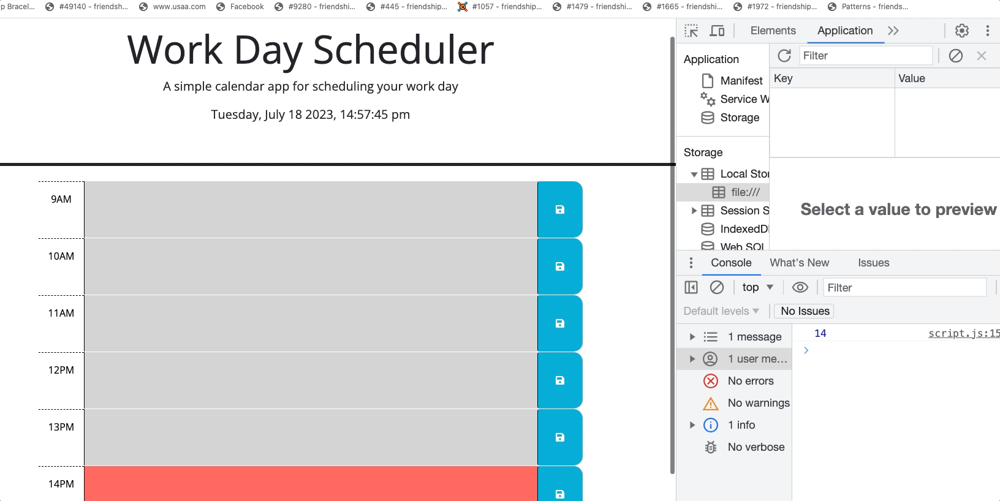

## Daily Work Scheduler

## Description

This application is intended to be used on a daily basis to organize events, projects, and time during work hours.

## Visuals

## Usage

The user is able to save an event in the designated time field by clicking the corresponding save button. Each time field will change colors, based on the time of the day, to remind the user which events are past, present, and future. 

## Roadmap

This app has no plans for updates in the future. 

## Project status

This project has been completed.